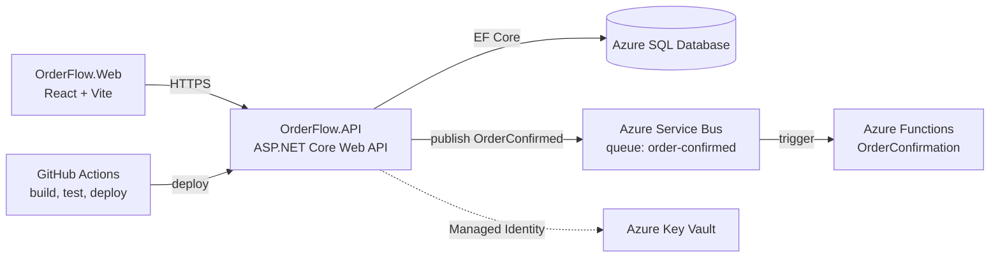

# OrderFlow

[](https://github.com/<your-username>/OrderFlow/actions/workflows/ci-cd.yml)

A cloud-native **order management system** built with **.NET and Azure**. It started as a modular monolith with Domain-Driven Design and was then extended step by step with CI/CD, messaging, containers and a React front end.

> **Note:** this is a self-directed learning project, built to gain hands-on experience with the Azure services below. It is not production software.

## Architecture



### Layers (Domain-Driven Design)

```
OrderFlow.API            HTTP layer (controllers, request contracts, validation)
OrderFlow.Application    Use cases (e.g. PlaceOrderHandler)
OrderFlow.Domain         Entities, business rules, repository interfaces (no dependencies)
OrderFlow.Infrastructure EF Core, repositories, Service Bus publisher
```

Dependencies point inward: Domain depends on nothing, and business rules (for example, an order cannot be confirmed without lines) live in the `Order` aggregate and are unit-tested without a database.

## Tech stack

| Area | Technologies |
|---|---|
| Backend | C#, .NET 10, ASP.NET Core Web API, Entity Framework Core, FluentValidation |
| Data | Azure SQL Database |
| Messaging and serverless | Azure Service Bus, Azure Functions (isolated worker model) |
| Security | Azure Key Vault, Managed Identity (`DefaultAzureCredential`) |
| CI/CD | GitHub Actions (build, test, deploy to Azure App Service) |
| Containers | Docker (multi-stage build), Azure Container Registry, Kubernetes manifests |
| Testing | xUnit |
| Frontend | React (Vite) |

## Project structure

```
OrderFlow.sln(x)
├── OrderFlow.API/                          Web API, Dockerfile, k8s manifests
├── OrderFlow.Application/                  Use cases
├── OrderFlow.Domain/                       Domain model
├── OrderFlow.Infrastructure/               Persistence and messaging
├── OrderFlow.Domain.Tests/                 xUnit tests for domain rules
├── OrderFlow.Functions.OrderConfirmation/  Service Bus triggered Azure Function
└── orderflow.web/                          React front end
```

## Main features

- Place an order and retrieve it by id (`POST /api/orders`, `GET /api/orders/{id}`)
- Input validation at the API boundary (FluentValidation)
- Business rules enforced inside the domain model
- Order-confirmed events published to Service Bus and consumed by a separate Azure Function, so the two services are loosely coupled and independently deployable
- Secrets kept out of source control: Key Vault accessed through Managed Identity
- Automated build, test and deploy pipeline

## Run locally

### Prerequisites

- .NET SDK (version 10.x)
- Visual Studio 2026, or any editor with the .NET SDK
- Node.js (for the React app)
- An Azure SQL Database, or any SQL Server instance (the connection string is not included in this repository)
- Optional: Docker Desktop

### 1. Configure secrets

This repository does **not** contain any credentials. Provide your own connection string using .NET user secrets (recommended):

```bash
cd OrderFlow.API
dotnet user-secrets set "ConnectionStrings:OrderFlowDb" "<your-sql-connection-string>"
```

Alternatively, create an `appsettings.Development.json` file (it is listed in `.gitignore`), or store the connection string in Azure Key Vault under the secret name `ConnectionStrings--OrderFlowDb`.

### 2. Create the database

```bash
dotnet ef database update --project OrderFlow.Infrastructure --startup-project OrderFlow.API
```

(or run `Update-Database` from the Package Manager Console in Visual Studio)

### 3. Run the API

```bash
dotnet run --project OrderFlow.API
```

Open `/swagger` on the local URL shown in the console to try the endpoints.

### 4. Run the React app

```bash
cd orderflow.web
npm install
npm run dev
```

Set `VITE_API_BASE_URL` in a local `.env` file to point at your API (the file is git-ignored).

### 5. Run the tests

```bash
dotnet test
```

## Docker

Build and run the API image from the repository root:

```bash
docker build -t orderflow-api -f OrderFlow.API/Dockerfile .
docker run -p 8080:8080 -e ASPNETCORE_ENVIRONMENT=Production orderflow-api
```

The image uses a multi-stage build, so the final image contains only the ASP.NET runtime and the published output, not the SDK.

Kubernetes manifests (Deployment and Service) are in `OrderFlow.API/k8s/`.

## CI/CD

The GitHub Actions workflow in `.github/workflows/ci-cd.yml`:

1. Restores, builds and runs the tests on every push and pull request
2. Deploys to Azure App Service when changes reach the default branch and the tests pass

Credentials are stored as GitHub repository secrets, not in the code.

## Planned improvements

- [ ] Infrastructure as Code with Bicep
- [ ] Application Insights for distributed tracing across the API, Service Bus and Function
- [ ] Azure Container Apps deployment
- [ ] Integration tests
- [ ] Authentication with Microsoft Entra ID
- [ ] Outbox pattern for guaranteed message delivery

## What I learned

- Modelling business rules in a domain layer that is independent of the database and web framework
- Passwordless access to Azure resources with Managed Identity and Key Vault
- Asynchronous, loosely coupled services with Service Bus and Azure Functions
- Building a CI/CD pipeline that blocks deployment when tests fail
- Packaging a .NET service in a container and describing its deployment declaratively

## Author

**Vivek Balasubramani** - Senior .NET Developer
[LinkedIn](https://www.linkedin.com/in/vivek-balasubramani-0666b320)
